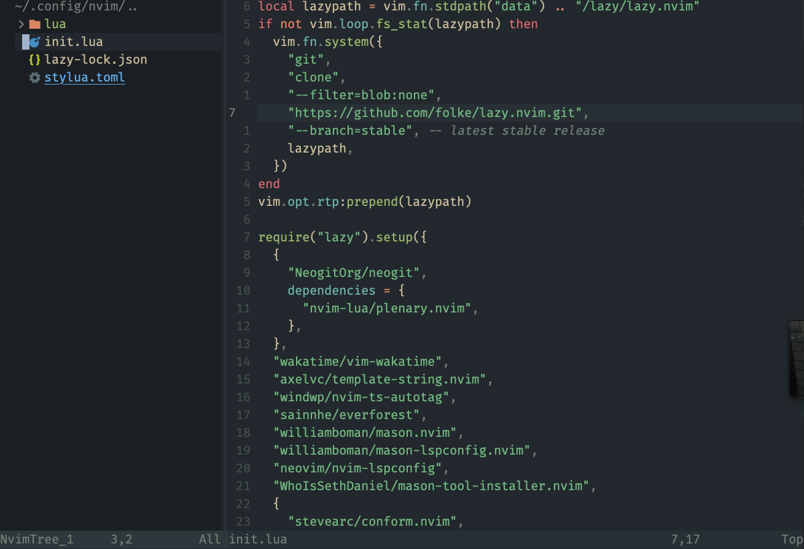
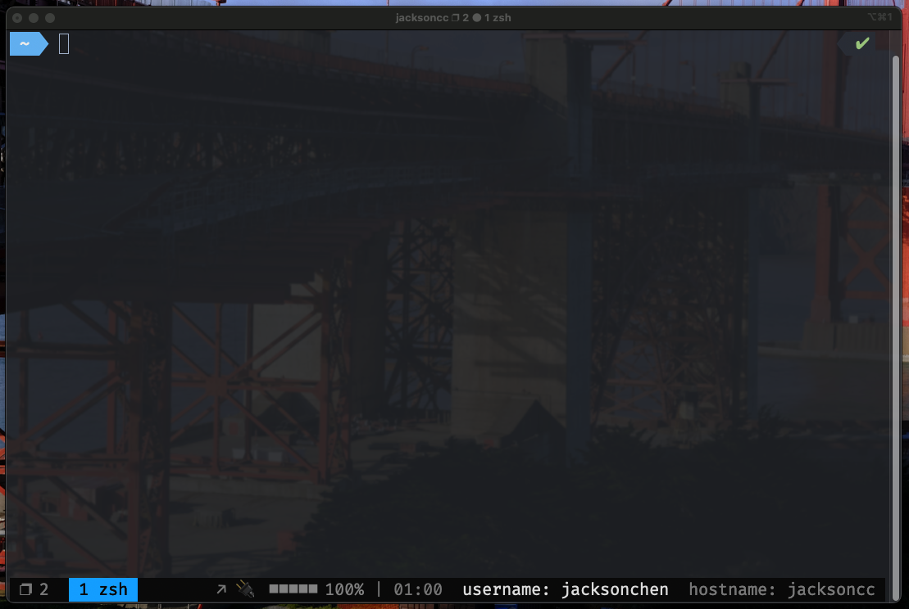
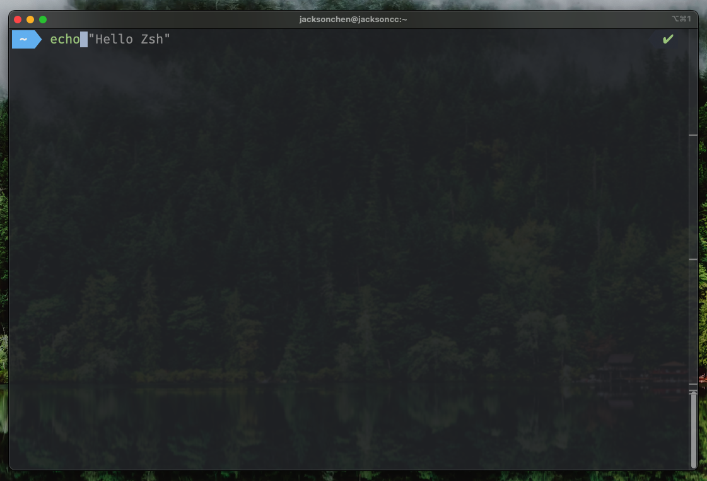

# Dotfiles Repository

This repository contains my personal dotfiles for various tools I use in my development environment. Below you will find a brief overview of each configuration file and a space for custom command descriptions.

Works for MacOS/Linux 💻

# Installations

get into your root dir

```bash
cd ~ && git clone https://github.com/Sma1lboy/.dotfiles.git

//for nvim settings
chmod +x ~/.dotfiles/nviminit.sh
~/.dotfiles/nviminit.sh

//for vim settings
chmod +x ~/.dotfiles/viminit.sh
~/.dotfiles/viminit.sh

//for tmux settings
chmod +x ~/.dotfiles/tmux.sh
~/.dotfiles/tmux.sh
```

> Therewill adding quick start for linux and macos, and it will support brewfile to install program if you dont have it


## .config/nvim

This directory contains my Neovim configuration files.

### **Content**



### Feature plugin I like to using

- template-string when using var, js string will change to template string with\`string ${var}\`
- Wakatime - recording time 
- ts autotag - it's for typescript
- Ever forest - the theme I love so much
- Mason - package management
- Mason lspconfig - extension of Mason, adding lspconfig management
- Nvim-lspconfig  - easily way management LSP
- Nvim-tree - tree stuck visualization
- telescope - telescope search keyword under current dir, also support bookmark
- Auto completion
- Treesitter

> WIP adding later

## .vim

This is my easy Vim configuration directory. for sometime you cannot using nvim
> Added more config to .vim config, it will update later

### Content


### The feature I like

I didn't change to much for my vim configuration, the main idea of my vim configuration is keep thing simple for cloud develope

- Relative number
- Vim-Plug - Plugin Manager and Installer
- Vim-lsp-settings - Easier way to setup LSP
- Auto completion with tab selection
- Auto-Pairs

When get into language, try  `:LspInstallServer` or check [vim-lsp-settings](https://github.com/mattn/vim-lsp-settings) to get LSP service

if you need linter or formatter, then add by yourself. I want to keep vim config clean, simple and easy to use.

**Custom Commands:**

> WIP

## tmux.conf

This file holds my local tmux configuration overrides.

### Content



Not fancy, keep simple, only showing the data you really need.

> WIP

## .zshrc

My Zsh shell configuration is defined in this file.

## Content



Zsh with

- Auto suggestion
- super sudo - press twice esc
- Zsh syntax highlight
- Fast-syntax-highlight
- Dirhistory- very important to me

Also, 

- Vim alias to NVIM
- typora alias to bin of typora
- lg alias to lazygit
