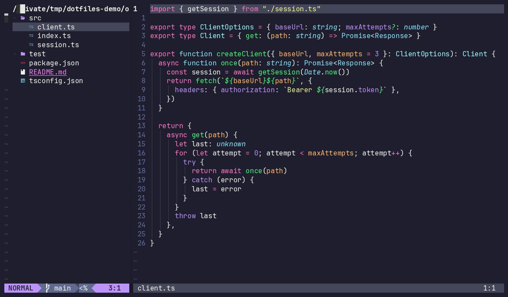
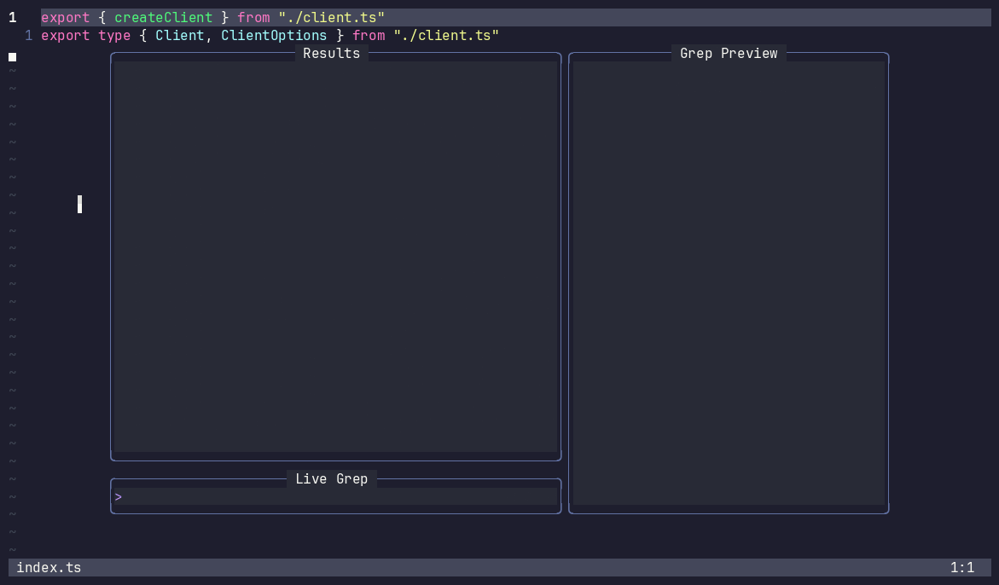
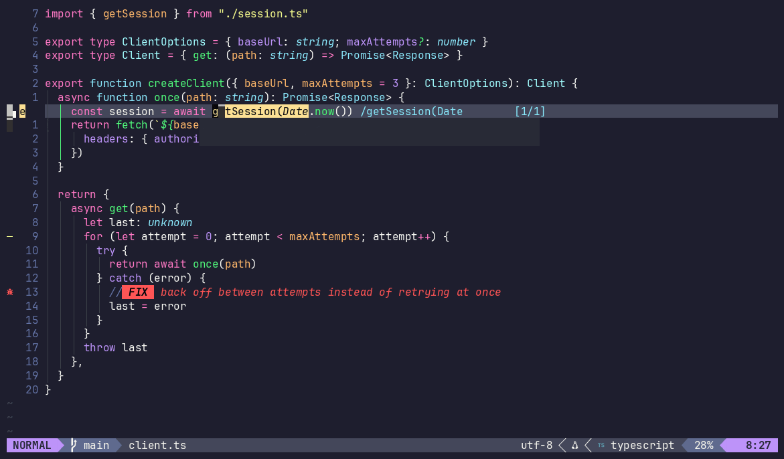
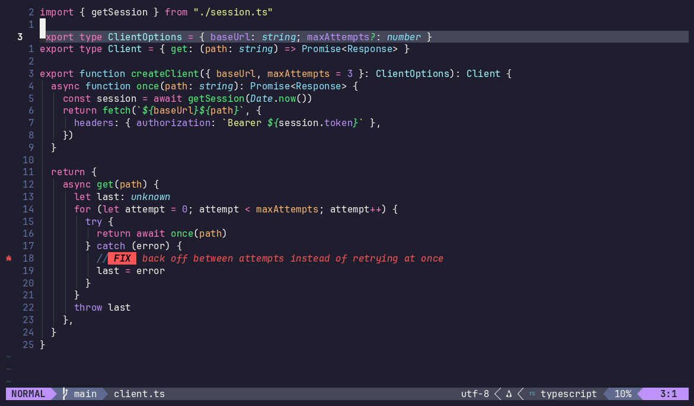
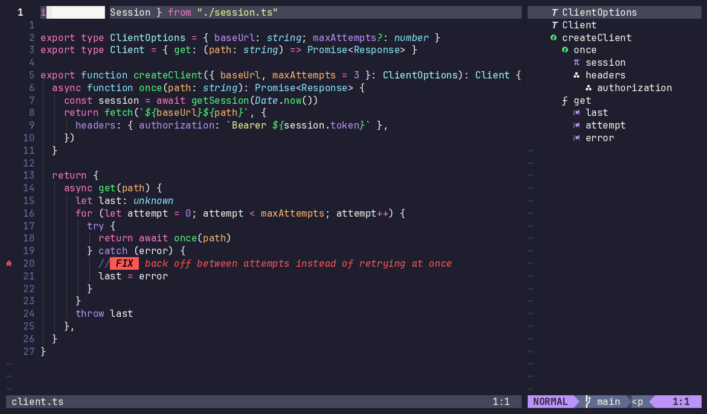
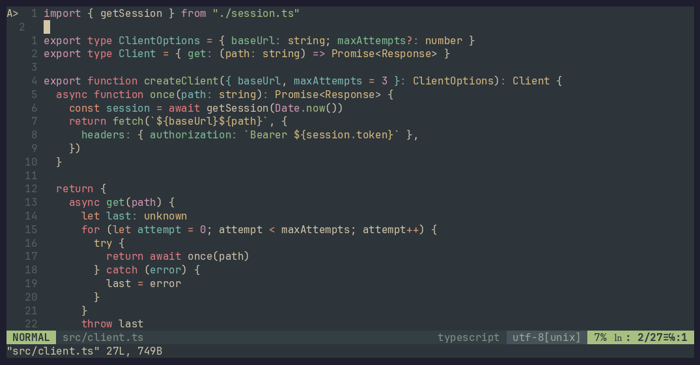
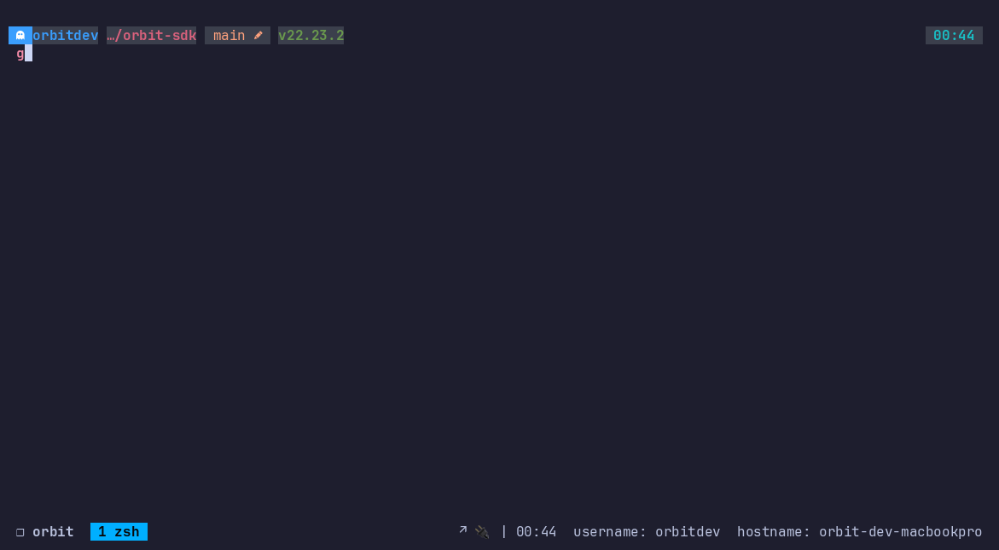
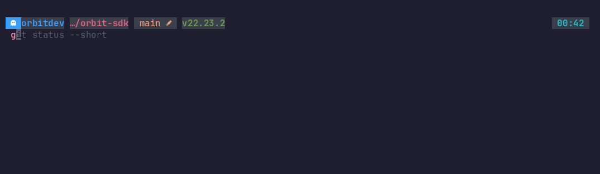
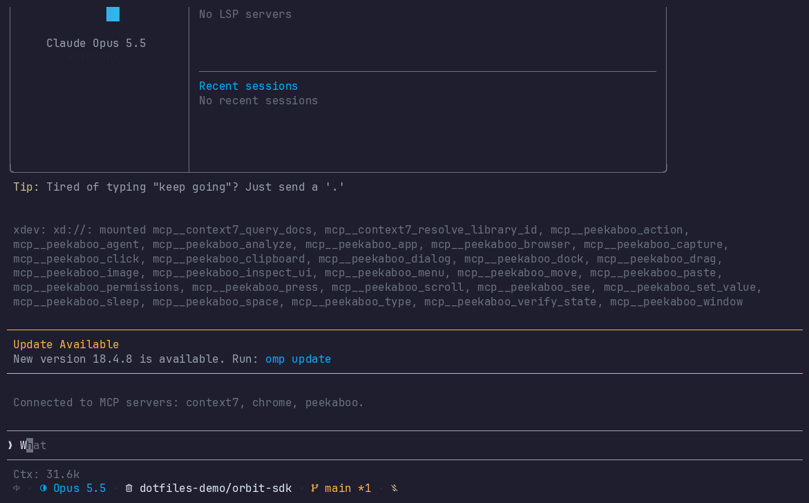

# dotfiles

My macOS (and mostly Linux) terminal setup: Neovim, tmux, zsh + starship, the
omp coding agent, and the AeroSpace tiling window manager. Every gif below is a
recording of these exact configs ([how](#readme-recordings)).



> [!NOTE]
> Personal configs, tuned for one machine. Read before you run `start.sh`:
> it replaces your existing configs with symlinks (backing them up first).

## Contents

| Tool | Config | What's in it |
| --- | --- | --- |
| [Neovim](#neovim) | `.config/nvim` | lazy.nvim, Dracula, Telescope, typescript-tools, gitsigns, Trouble, toggleterm, which-key |
| [Vim](#vim) | `.vimrc`, `.vim` | vim-plug, everforest, airline, vim-lsp, auto-pairs |
| [tmux](#tmux) | `.tmux.conf`, `.tmux.conf.local` | oh-my-tmux, `C-a` prefix, `\|`/`-` splits, Alt-number windows |
| [zsh](#zsh--starship) | `.zshrc` | starship prompt, autosuggestions, syntax highlighting, prefix history search |
| [starship](#zsh--starship) | `.config/starship.toml`, `.config/starship-presets` | custom prompt + 11 presets, switched with `sp` |
| [omp](#omp) | `.omp/agent` | model roles, status line, 11 extensions, theme, plugins |
| [AeroSpace](#aerospace) | `.config/aerospace` | tiling window manager on `alt` |
| [Others](#others) | `.config/ccstatusline`, `.config/fastfetch`, … | Claude Code status line, fastfetch logos |

## Install

```bash
git clone https://github.com/Sma1lboy/.dotfiles.git ~/.dotfiles
cd ~/.dotfiles
./start.sh
```

`start.sh` runs, in order:

1. `script/preinstall.sh`: Homebrew on macOS (git, tmux, node, neovim, gcc, coreutils, lazygit, neofetch, fastfetch, AeroSpace) or apt on Linux.
2. `script/backup.sh`: copies the configs it is about to replace.
3. One script per tool (`nvim`, `tmux`, `zsh`, `ccstatusline`, `omp`, and on macOS `aerospace` and `fastfetch`) that symlinks the config into place.

To install only the dependencies: `./script/preinstall.sh`.

**Requirements:** a [Nerd Font](https://www.nerdfonts.com/) (I use JetBrainsMono Nerd Font Mono in [Ghostty](https://ghostty.org) with Catppuccin Mocha) and Neovim 0.11+.

## Neovim

Leader is <kbd>Space</kbd>; press it and wait for which-key to list everything under it.
Plugins are managed by lazy.nvim and pinned in `lazy-lock.json`; LSP servers and
tools by Mason.

### Find and navigate

| Key | Action |
| --- | --- |
| <kbd>C-e</kbd> | toggle the nvim-tree file tree |
| <kbd>Space</kbd> <kbd>f</kbd> | find files (Telescope) |
| <kbd>Space</kbd> <kbd>g</kbd> | live grep |
| <kbd>Space</kbd> <kbd>t</kbd> | every TODO / FIX / HACK in the project |
| <kbd>]t</kbd> / <kbd>[t</kbd> | next / previous TODO comment |



### Language servers

TypeScript runs on typescript-tools (the project's own `tsserver`); Lua on
lua-language-server. Diagnostics go to Trouble.

| Key | Action |
| --- | --- |
| <kbd>K</kbd> | hover docs |
| <kbd>g</kbd><kbd>D</kbd> / <kbd>g</kbd><kbd>r</kbd> / <kbd>g</kbd><kbd>I</kbd> / <kbd>g</kbd><kbd>Y</kbd> | definitions / references / implementations / type definitions (Telescope) |
| <kbd>Space</kbd> <kbd>r</kbd> | rename |
| <kbd>Space</kbd> <kbd>c</kbd><kbd>a</kbd> | code actions |
| <kbd>Space</kbd> <kbd>x</kbd><kbd>x</kbd> | diagnostics (Trouble) |
| <kbd>Space</kbd> <kbd>m</kbd> / <kbd>a</kbd> / <kbd>z</kbd> | TS: organize / add missing / remove unused imports |



### Git

gitsigns marks added, changed and deleted lines in the gutter as you type, and
shows blame and hunks on demand (`:Gitsigns toggle_current_line_blame`,
`:Gitsigns preview_hunk`).



### Tools

| Key | Action |
| --- | --- |
| <kbd>Space</kbd> <kbd>O</kbd> | symbols outline |
| <kbd>C-j</kbd> | toggle a terminal (toggleterm) |
| <kbd>Space</kbd> <kbd>Z</kbd> | zen mode |
| <kbd>Space</kbd> <kbd>w</kbd> / <kbd>q</kbd> / <kbd>x</kbd> | save / quit / save and quit |
| <kbd>Tab</kbd> / <kbd>S-Tab</kbd> | indent / outdent |



Also in the config: Copilot (<kbd>C-l</kbd> accepts), Comment.nvim, nvim-dap,
avante.nvim (<kbd>Space</kbd> <kbd>a</kbd><kbd>a</kbd>), leetcode.nvim
(<kbd>Space</kbd> <kbd>0</kbd>), template-string, colorizer, smear-cursor, Wakatime.

## Vim

A small `.vimrc` for machines without Neovim: relative numbers, vim-plug,
everforest, airline, vim-lsp with vim-lsp-settings (`:LspInstallServer`),
asyncomplete with <kbd>Tab</kbd> selection, auto-pairs, ALE.



> The plugin directories in `.vim/plugged` are not committed; run `:PlugInstall` once.

## tmux

[oh-my-tmux](https://github.com/gpakosz/.tmux) with local overrides in
`.tmux.conf.local`. The status bar shows the session, battery, time, user and host.

| Key | Action |
| --- | --- |
| <kbd>C-a</kbd> | prefix |
| prefix <kbd>\|</kbd> / <kbd>-</kbd> | split side by side / stacked, in the current directory |
| prefix <kbd>z</kbd> / <kbd>+</kbd> | zoom / maximize a pane |
| prefix <kbd>H</kbd><kbd>J</kbd><kbd>K</kbd><kbd>L</kbd> | resize |
| prefix <kbd>c</kbd> | new window |
| <kbd>Alt</kbd>-<kbd>1</kbd>…<kbd>9</kbd> | go to window |
| <kbd>Alt</kbd>-<kbd>h</kbd> / <kbd>l</kbd> / <kbd>Tab</kbd> | previous / next / last window |
| prefix <kbd>m</kbd> | toggle mouse |
| prefix <kbd>e</kbd> / <kbd>r</kbd> | edit / reload the config |



## zsh + starship

| | |
| --- | --- |
| Prompt | starship (`.config/starship.toml`); `sp` lists the 11 presets in `.config/starship-presets`, `sp <name>` applies one |
| Suggestions | zsh-autosuggestions; <kbd>→</kbd> accepts, <kbd>C-Space</kbd> accepts and runs |
| History | <kbd>↑</kbd> / <kbd>↓</kbd> search history by what is already typed |
| Highlighting | zsh-syntax-highlighting |
| Aliases | `vim` → nvim, `ls` → lsd, `lg` → lazygit, `a` → yazi |
| Secrets | API keys go in `~/.zshrc.local` (untracked) |



## omp

Config for [omp](https://github.com/can1357/oh-my-pi), the coding agent:
`script/omp.sh` symlinks `config.yml`, `extensions/` and `themes/` into
`~/.omp/agent`, copies `mcp.json`, installs the plugins in `.omp/plugins.txt`,
and points git hooks at `.githooks` so every `git pull` re-syncs plugins.



- **Model roles** (`config.yml`): Opus for default work, Sonnet for subagents, a stronger model as advisor, GPT models for plan / smol / tiny. A daily cloud routine ([`.omp/model-watch/ROUTINE.md`](.omp/model-watch/ROUTINE.md)) bumps them to the newest model of each family on `main`, and the `omp` shell function pulls them in (`.omp/sync-model-roles.sh`) before every launch.
- **Status line:** model and thinking level, path, git state, PR, cost, session name; titanium-custom theme.

Extensions in `.omp/agent/extensions`:

| Extension | What it does |
| --- | --- |
| `turnline` | live "Thinking · 12s" row while a turn runs, then "Worked for 1m 23s" |
| `usageline` | context size, output speed, cache time left and hit rate, today's cost; `/usageline` prints the ledger |
| `tool-fold` | folds consecutive tool calls into one row |
| `user-bubble` | a compact echo of your message, like Claude Code |
| `consult-advisor` | an `advisor` tool that forwards the conversation to a stronger model |
| `goal-loop` | goal and loop as tools the model calls from what you say |
| `bg-hotkey` | <kbd>C-b</kbd> <kbd>C-b</kbd> sends the running command to the background |
| `slash-aliases` | `/rewind` → `/checkpoint` (better-pi-rewind) |
| `rove-graphics`, `rove-activity`, `herdr-omp-agent-state` | integration with Rove and herdr (the last two are generated by those tools) |

## AeroSpace

Tiling window manager (`.config/aerospace/aerospace.toml`).
Floating: Picture-in-Picture (follows the focused workspace) and Typeless.

| Key | Action |
| --- | --- |
| <kbd>Alt</kbd>-<kbd>h</kbd><kbd>j</kbd><kbd>k</kbd><kbd>l</kbd> | focus |
| <kbd>Alt</kbd>-<kbd>Shift</kbd>-<kbd>h</kbd><kbd>j</kbd><kbd>k</kbd><kbd>l</kbd> | move window |
| <kbd>Alt</kbd>-<kbd>1</kbd>…<kbd>9</kbd> / <kbd>Alt</kbd>-<kbd>Shift</kbd>-<kbd>1</kbd>…<kbd>9</kbd> | go to / move window to workspace |
| <kbd>Alt</kbd>-<kbd>Tab</kbd> | previous workspace |
| <kbd>Alt</kbd>-<kbd>s</kbd> / <kbd>d</kbd> | focus monitor left / right |
| <kbd>Alt</kbd>-<kbd>f</kbd> / <kbd>Alt</kbd>-<kbd>Shift</kbd>-<kbd>m</kbd> | float / fullscreen |
| <kbd>Alt</kbd>-<kbd>/</kbd> / <kbd>Alt</kbd>-<kbd>,</kbd> | tiles / accordion layout |
| <kbd>Alt</kbd>-<kbd>=</kbd> / <kbd>-</kbd> | resize |

## Others

- **ccstatusline** (`.config/ccstatusline`): Claude Code status line with session cost and cache timer / hit rate / miss-reason widgets.
- **fastfetch** (`.config/fastfetch`): system info with a random image from `pngs/` as the logo.
- **Retired:** yabai, skhd and sketchybar configs are kept but no longer installed; yabai does not keep up with recent macOS.

## Layout

```
.
├── start.sh                 one-shot setup
├── script/                  per-tool install / symlink scripts
├── .config/                 nvim, aerospace, starship, ccstatusline, fastfetch, …
├── .omp/agent/              omp config, extensions, theme
├── .tmux.conf(.local)       tmux
├── .zshrc  .vimrc  .vim/    shells and Vim
└── readme/                  the gifs, their recordings, and the scripts that make them
```

## README recordings

The gifs are recordings of these configs, not screenshots. Each one is a
scripted take in `readme/rec/scenes/`, recorded once into
`readme/casts/<scene>.cast` (asciicast) and rendered from that file, so pacing
and look change without re-recording.

```bash
brew install asciinema agg
readme/rec/record.sh nvim-lsp  # re-take one scene against this machine's configs
readme/rec/render.sh           # every cast -> readme/<scene>.gif
```

A take runs on its own tmux socket in a throwaway TypeScript repo under `/tmp`,
and is refused if the recording still shows your user name, host name, home
path or an e-mail address after the same-length swap to `orbitdev`. The `omp`
take runs one real (small) model turn.
