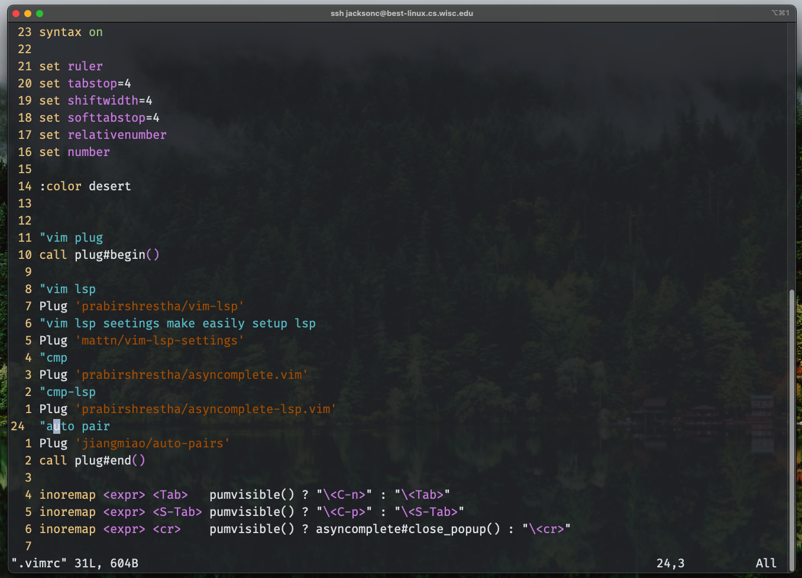

> [!WARNING]
> This repo is refacotring right now, it will finishing soon
> Not support for vim script for now

# Dotfiles Repository

This repository contains my personal dotfiles for various tools I use in my development environment. Below you will find a brief overview of each configuration file and a space for custom command descriptions.

Works for MacOS/Linux 💻 (no windows)

# Quick Installation

The installation process has been greatly simplified! Now you can set up everything with just one command:

```bash
# Clone the repository
git clone https://github.com/Sma1lboy/dotfiles.git
cd dotfiles

# Make the start script executable
chmod +x start.sh

# Run the start script
./start.sh
```

The `start.sh` script will automatically:

- Install required dependencies for your OS (macOS or Linux)
- Set up Neovim, tmux, and other configurations
- Install ZSH plugins
- Configure window manager (Aerospace for macOS)
- Create symbolic links for all configuration files

> Note: For macOS users, it will install Homebrew packages including coreutils, lazygit, fastfetch, and window management tools.

## Installing Dependencies Only

If you only want to install the required dependencies without configuring dotfiles, you can use:

```bash
# Make the script executable
chmod +x script/preinstall.sh

# Run the preinstall script
./script/preinstall.sh
```

### Currently Supported Software (macOS)

The preinstall script will install the following tools for macOS:

- Xcode Command Line Tools
- Homebrew
- git
- tmux
- neofetch
- node
- neovim
- gcc
- coreutils
- lazygit
- fastfetch
- Aerospace window manager
- JankyBorders

> **Note**: Yabai, skhd, and sketchybar are currently disabled in the installation script as Yabai is not fully compatible with newer macOS versions. The project now uses Aerospace as the primary window manager instead.

## .config/nvim

This directory contains my Neovim configuration files.

### **Content**


### Feature plugin I like to using

- template-string when using var, js string will change to template string with\`string ${var}\`
- Wakatime - recording time
- ts autotag - it's for typescript
- Ever forest - the theme I love so much
- Mason - package management
- Mason lspconfig - extension of Mason, adding lspconfig management
- Nvim-lspconfig - easily way management LSP
- Nvim-tree - tree stuck visualization
- telescope - telescope search keyword under current dir, also support bookmark
- Auto completion
- Treesitter

> WIP adding later

## .vim

This is my easy Vim configuration directory. for sometime you cannot using nvim

> Added more config to .vim config, it will update later

### Content



### The feature I like

I didn't change to much for my vim configuration, the main idea of my vim configuration is keep thing simple for cloud develope

- Relative number
- Vim-Plug - Plugin Manager and Installer
- Vim-lsp-settings - Easier way to setup LSP
- Auto completion with tab selection
- Auto-Pairs

When get into language, try `:LspInstallServer` or check [vim-lsp-settings](https://github.com/mattn/vim-lsp-settings) to get LSP service

if you need linter or formatter, then add by yourself. I want to keep vim config clean, simple and easy to use.

**Custom Commands:**

> WIP

## tmux.conf

This file holds my local tmux configuration overrides.

### Content


Not fancy, keep simple, only showing the data you really need.

> WIP

## .zshrc

My Zsh shell configuration is defined in this file.

## Content


Zsh with

- Auto suggestion
- super sudo - press twice esc
- Zsh syntax highlight
- Fast-syntax-highlight
- Dirhistory- very important to me

Also,

- Vim alias to NVIM
- typora alias to bin of typora
- lg alias to lazygit
